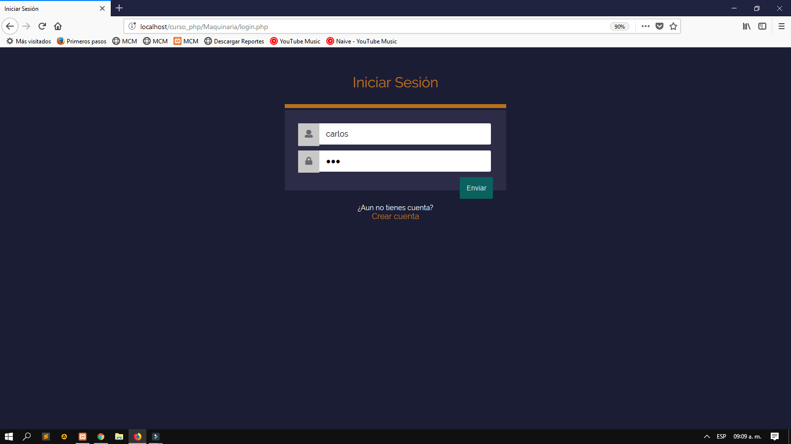
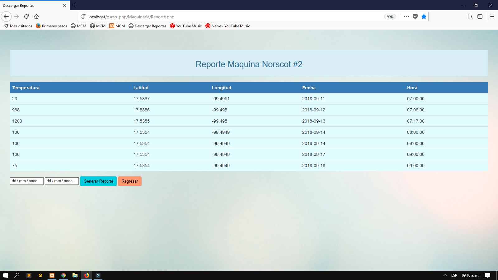

# 📡 Sistema de Control y Monitoreo de Maquinaria de Construcción

Este proyecto presenta un sistema integral de **control y monitoreo remoto** para maquinaria de construcción utilizando **Arduino UNO**, módulos **GSM/GPS**, sensores de temperatura tipo **termopar**, y una **aplicación web** desarrollada en PHP y JavaScript. El sistema permite supervisar en tiempo real el estado operativo de la maquinaria, su ubicación geográfica, la temperatura del equipo y realizar el **encendido o apagado remoto** desde una interfaz web.

---

## 📌 Objetivo del proyecto

Desarrollar un sistema accesible y de bajo costo que permita controlar y monitorear maquinaria de construcción para prevenir fallas mecánicas, robos o usos no autorizados mediante tecnologías integradas de geolocalización, sensores y comunicación móvil.

---

## ⚙️ Componentes del sistema

### 🔧 Hardware

- Arduino UNO
- Módulo GSM SIM900
- Módulo GPS Ublox NEO-6M
- Módulo Ethernet W5100
- Termopar tipo K con módulo MAX6675
- Relevador para corte de energía
- Fuente reguladora (LM7805)
- Ventilador para disipación de calor

### 💻 Software

- Arduino IDE (código en C/C++)
- XAMPP (Servidor Apache + MySQL + PHP)
- Sublime Text (edición de HTML, CSS, JS)
- PHP, HTML, CSS, JavaScript
- Google Maps API + Google Charts

---

---

## 🧭 Funcionamiento general del sistema

1. **Nodo en la maquinaria**  
   - Lee temperatura con el termopar
   - Obtiene posición GPS
   - Envia datos mediante GSM al nodo receptor

2. **Nodo en el servidor web**
   - Recibe datos vía GSM
   - Conecta con el servidor web por Ethernet
   - Guarda datos en base de datos MySQL

3. **Aplicación Web**
   - Visualiza estado (encendido/apagado), ubicación y temperatura
   - Permite enviar comandos remotos para encender o apagar maquinaria

---

## 🖼️ Capturas del sistema

### 🔐 Inicio de sesión  

### 🖥️ Interfaz de monitoreo  
Visualización del estado de la máquina, ubicación geográfica y temperatura en tiempo real:  

### 🗄️ Base de datos del monitoreo  

---

## 🎥 Demostración en video

📽️ [Ver demostración completa del sistema](Video.mp4)

> Incluye pruebas reales de rastreo, control y operación en tiempo real del sistema instalado.

---

## 🚀 Cómo ejecutar el sistema

### 1. Requisitos

- Arduino UNO × 2
- Módulos GSM, GPS, Ethernet
- Termopar + MAX6675
- Computadora con XAMPP
- Conexión a red local

### 2. Configuración del hardware

- Cargar los programas Arduino desde `Codigos_Maquinaria_Arduino.zip`
- Realizar conexiones según los diagramas incluidos en la tesis:
  - Nodo maquinaria: Arduino + GPS + GSM + termopar
  - Nodo servidor: Arduino + GSM + Ethernet
- Alimentar con fuente regulada de 5V

### 3. Configuración del servidor

- Instalar XAMPP y activar Apache y MySQL
- Crear base de datos `maquinaria_db` desde phpMyAdmin
- Subir archivos web al directorio `htdocs/maquinaria`
- Modificar credenciales de conexión en `ConexBD.php` si es necesario

### 4. Acceso al sistema

- Abrir navegador y acceder a:  
  `http://localhost/maquinaria`
- Iniciar sesión con las credenciales creadas
- Visualizar, controlar y monitorear maquinaria en tiempo real

---

## ✅ Resultados esperados

- Visualización en tiempo real del estado de la maquinaria
- Control remoto de encendido y apagado desde la web
- Registro automático en la base de datos MySQL cada 3 minutos
- Ubicación GPS precisa mediante Google Maps API
- Medidor gráfico de temperatura con Google Charts

---

## 📚 Información técnica

- El sistema utiliza **comandos AT** para la comunicación GSM
- La ubicación se obtiene con sentencias **NMEA** del GPS y se procesa con la librería `TinyGPS`
- El control ON/OFF se gestiona mediante un script PHP que envía señales por el **puerto COM**
- Se utiliza Google Maps API para visualizar el punto GPS en un mapa interactivo
- La aplicación es responsive, ejecutable desde cualquier equipo conectado a la red local

---

## 🏁 Conclusión

Este sistema demuestra cómo una solución basada en tecnologías accesibles puede competir con herramientas comerciales de alto costo. Además, su escalabilidad permite futuras implementaciones como lectura de combustible, cámaras, o acceso desde aplicaciones móviles.

---

---

**¡Gracias por visitar este repositorio! Si te resulta útil, no olvides dar ⭐ en GitHub.**

