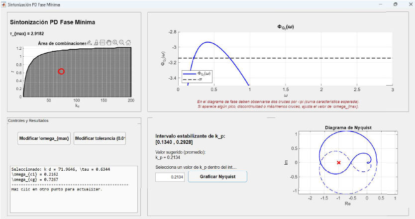

# ??? Interactive PD/PID Controller Design Tool

  
   
  

## ?? Description
MATLAB-based interactive tool for designing and analyzing PD/PID controllers for systems with:
- Time delays
- Two unstable poles
- Complex conjugate pole pairs

## ? Key Features
- **Three Control Modules**:
  - Non-minimum phase PD controller
  - Non-minimum phase PID controller  
  - Minimum phase PD controller
- **Visual Stability Analysis**:
  - Nyquist diagrams
  - Phase margin evaluation
  - Parameter stability regions
- **Educational Focus**:
  - Intuitive GUI for teaching control concepts
  - Real-time parameter adjustment effects

## ?? Download & Installation
1. **Executable Version** (No MATLAB required):
   - [Download ControllerPD_PID.exe](ControllerPD_PID.exe)
   
2. **Source Code** (MATLAB required):
   - [Download code.zip](code.zip)

## ??? Screenshots
| PD Controller | PID Controller | Minimum Phase PD |
|--------------|---------------|------------------|
|  |  |  |

## ?? Quick Start
1. Run the executable or MATLAB script
2. Enter system parameters in main interface
3. Select controller type (PD/PID)
4. Analyze stability regions and Nyquist plots
5. Export your controller design

## ?? Academic Background
Developed as part of PhD research in Control Systems at Instituto Polit¨¦cnico Nacional. Implements theoretical stability conditions from:
- Modified Smith Predictor architectures  
- Observer-predictor control frameworks
- Frequency-domain stability analysis

## ?? Related Publications
- [Journal of Process Control Paper](https://doi.org/10.1016/j.jprocont.2024.103299)
- [Asian Journal of Control Paper](https://onlinelibrary.wiley.com/doi/10.1002/asjc.2914)  