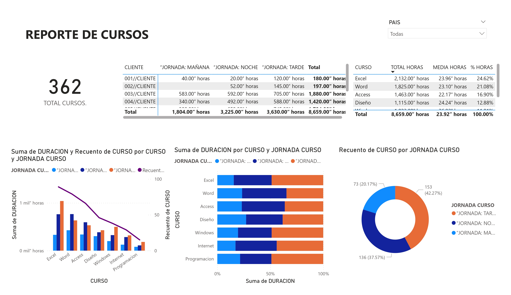

<!-- Encabezado con banner estilizado -->

  
  <h1>📊 Power BI Dashboard Portfolio</h1>
  
Interactive data visualization solutions for business intelligence

  

---

## 🌟 Featured Dashboards

### 📈 Ventas Globales

  

**Descripción**:  
Análisis de ventas internacionales con desglose por país, continente y período (2025-2027).

---

### 🎓 Cursos BD - Análisis Clientes

  

**Descripción**:  
Reporte de capacitación corporativa (2019-2021) con análisis de clientes, cursos y jornadas.

---

### 💼 Facturación Clientes

  

**Descripción**:  
Análisis de facturación por cliente, sector y concepto.

---

## 🛠️ Cómo Utilizar

1. Haz clic en el botón **Descargar PBIX**
2. Abre el archivo en Power BI Desktop (versión 2.120+ recomendada)
3. Actualiza conexiones de datos si es necesario (Ctrl+Alt+R)
4. Explora los filtros interactivos:
   - Selectores por período
   - Filtros por categoría/cliente
   - Segmentaciones geográficas

  

