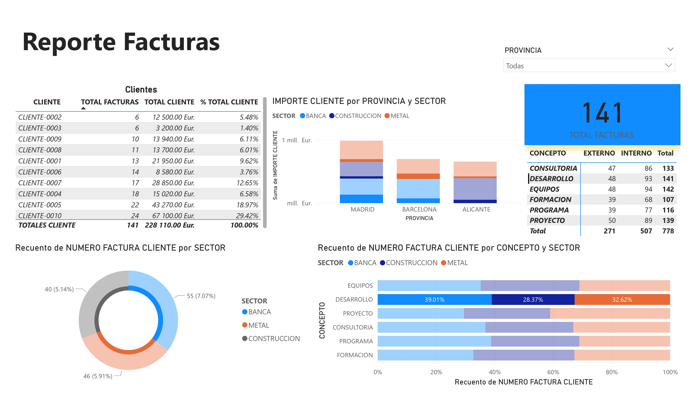

# 📊 Power BI Dashboard Portfolio

  
  <h2>Business Intelligence Solutions</h2>
  
Interactive reports for data-driven decision making

---

## 🏆 Featured Dashboards

### 🌍 Global Sales Analysis

**Key Insights**:
- $671M total profit (19.95% avg margin)
- Americas generate 39.14% of profits
- USA leads with 24.47% profit margin
- Clear quarterly growth trends

---

### 🎓 Corporate Training

**Key Insights**:
- Excel most demanded (24.62% training hours)
- Night shift has 42.27% participation
- Top client generated €65,500 revenue

---

### 💰 Client Billing

**Key Insights**:
- Banking sector: 30.98% of invoices
- Consulting most frequent service (133 cases)

---

## 🛠️ Technical Details

**Data Sources**:
- SQL Databases
- Excel Files
- API Integrations

**Main Visualizations**:
- Interactive maps
- Time-series analysis
- Comparative KPI cards
- Drill-through hierarchies

  

