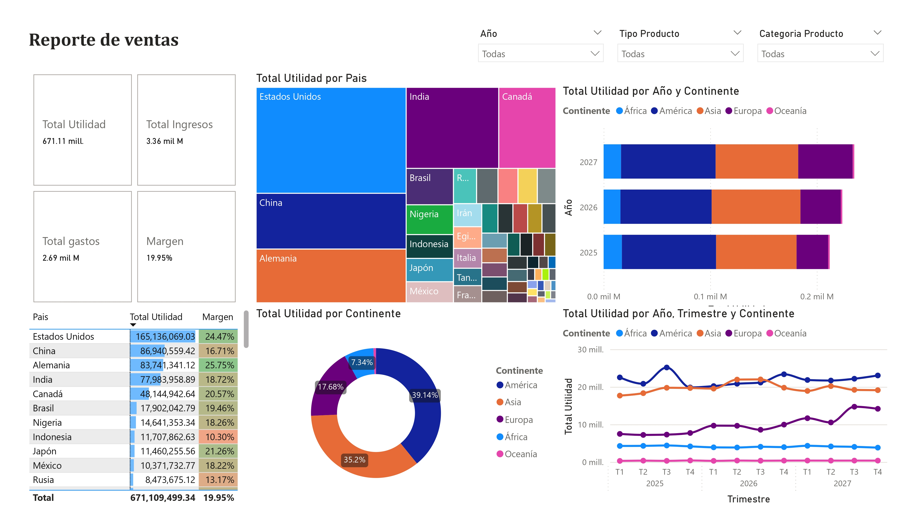

  

<h1 align="center">Luis Alberto Barragán Bonilla </h1>
<h3 align="center">PhD | Data Analyst & Control Systems Specialist</h3>

  

---

## 🌟 About Me

  

- 🎓 PhD in Communications & Electronics with **data analysis** expertise
- 📊 Created **10+ interactive dashboards** for business intelligence
- 👨‍🏫 Educator in **Python, SQL, and data visualization**
- ⚡ Passion for **hardware-software integration**

---

## 🚀 Featured Project

  
  

**Maxter Analytics AI Features**:
- 🧠 **Multi-Agent Hive Architecture**: Orchestration of specialized AI agents built on Gemini 2.5 Pro.
- 📈 **Big Data Processing**: Real-time analysis of **+321 Million records** from BigQuery.
- 🎯 **Strategic Modules**: Instant access to Pareto, Matriz BCG, Price Elasticity, and Profit Leakage analysis.
- ✅ **Financial Parity**: Achieved 100% data integrity with SAP S/4HANA Sales Cube.

---

## 📊 Business Intelligence & Dashboards

  
  

**Dashboard Features**:
- 📈 Sales performance tracking ($671M profit analyzed)
- 🌍 Geospatial visualization by country/region
- 📅 Time-series analysis with quarterly trends

---

## 🛠️ Technical Stack

### Data Analytics

  
|  |  |  |
|------------|------------|------------|

|  |  |  |
|------------|------------|------------|

### Additional Skills

  
|  |  |  |
|------------|------------|------------|

---

## 💼 Professional Experience

### 🎓 Data Analytics Instructor  
**Universidad del Valle de México** | 2024–2025  
- Designed **Power BI/Tableau curriculum** for data bootcamps  
- Mentored students in **data cleaning and visualization**  
- Supervised **10+ real-world dashboard projects**  

### 🔬 Control Systems Professor  
**Instituto Politécnico Nacional** | 2021–2023  
- Developed **MATLAB data analysis** scripts  
- Implemented **statistical process control** methods  

---

## 🎨 Other Projects

  

---

## 📚 Publications

- **[Modified Smith Predictor](https://doi.org/10.1016/j.jprocont.2024.103299)**  
*Journal of Process Control, 2024*  
- **[Observer-predictor Control](https://onlinelibrary.wiley.com/doi/10.1002/asjc.2914)**  
*Asian Journal of Control, 2023*  

---

  

  

✨ Thank you for visiting my profile! ✨

