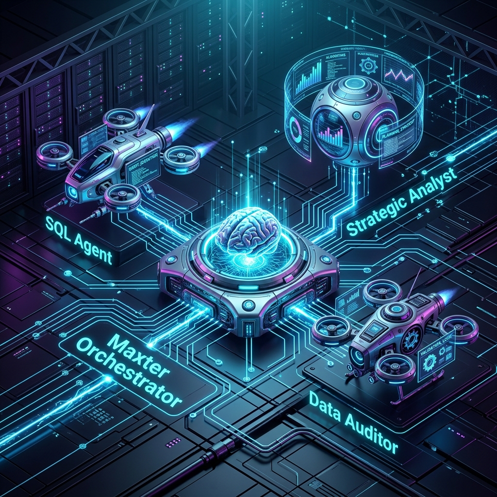

# Luis Alberto Barragán Bonilla, PhD
### Senior Business Intelligence Lead

---

## 🏛️ Professional Profile
Senior BI Lead y Doctor en Ciencias (PhD) especializado en **Arquitecturas Lógicas de Datos** y habilitación de **Business Intelligence estratégico**. Experto en la construcción de pipelines escalables y sistemas de visualización de alto impacto bajo metodologías Ágiles (Scrum).

> [!NOTE]
> Mi enfoque se centra en el **Modern Data Stack (GCP, BigQuery, Airflow)** y la integración disruptiva de **IA Generativa** para optimizar la toma de decisiones ejecutivas.

---

## 🚀 Featured AI Project: Maxter Analytics

  

**AI-Driven Decision Making**:
- 🧠 **Multi-Agent System**: Orquestación autónoma de agentes Gemini para análisis financiero detallado.
- ⚡ **Scale**: Procesamiento en tiempo real de **+321 Millones de registros**.
- ✅ **Parity**: 100% de paridad financiera validada contra SAP S/4HANA.
- 🏦 [Explorar Arquitectura y Resultados](Maxter-AI-Analytics/index.html)

---

## 💼 Enterprise Experience (Highlights)

### **Senior Business Intelligence Lead** | Empresa Líder en Retail
*Julio 2025 – Presente*

- **Liderazgo C-Suite:** Traducción de necesidades de negocio para la Dirección General en rutas analíticas críticas.
- **FinOps & Cloud Optimization:** Refactorización técnica que redujo un **60% la factura de nube** y un **70% los tiempos de extracción**.
- **Data Governance:** Responsable de la integridad y disponibilidad de la reportería ejecutiva corporativa.
- **Proyectos Estratégicos:**
    - Pipelines de ventas en tiempo real (Latencia < 10 min).
    - Motores analíticos de rentabilidad (Matriz BCG) e IA para proyección de ventas.
    - Arquitecturas NPS (Voice of Customer) con análisis de sentimiento mediante LLMs.

---

## 🛠️ Technical Ecosystem

| **Data Engineering** | **AI & Machine Learning** | **Business Intelligence** |
|:---:|:---:|:---:|
| Google Cloud (GCP) | Gemini / Vertex AI | Tableau (Server/Cloud) |
| BigQuery / Airflow | LangChain / LLM Agents | Looker Studio |
| SQL Avanzado / Python | Modelado Predictivo | Power BI / DAX |
| ETL/ELT Architectures | FinOps & MLOps | UI/UX Data Design |

---

## 🎓 Academic Foundations & Research

- **PhD en Comunicaciones y Electrónica** (IPN)
- **Investigador Científico:** Autor de 4 artículos JCR sobre sistemas de control y modelado matemático complejo.
- **Docente de Tecnología (UVM):** Capacitación en Python, SQL y BI Storytelling.

---

  <i>"Transformando infraestructuras complejas en motores de crecimiento estratégico."</i>

